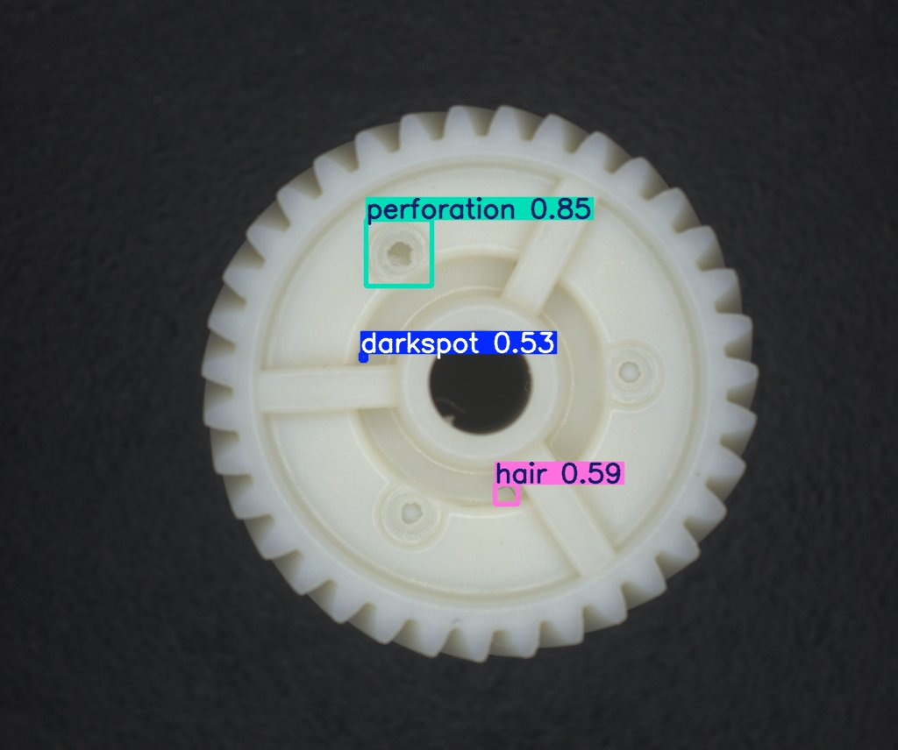
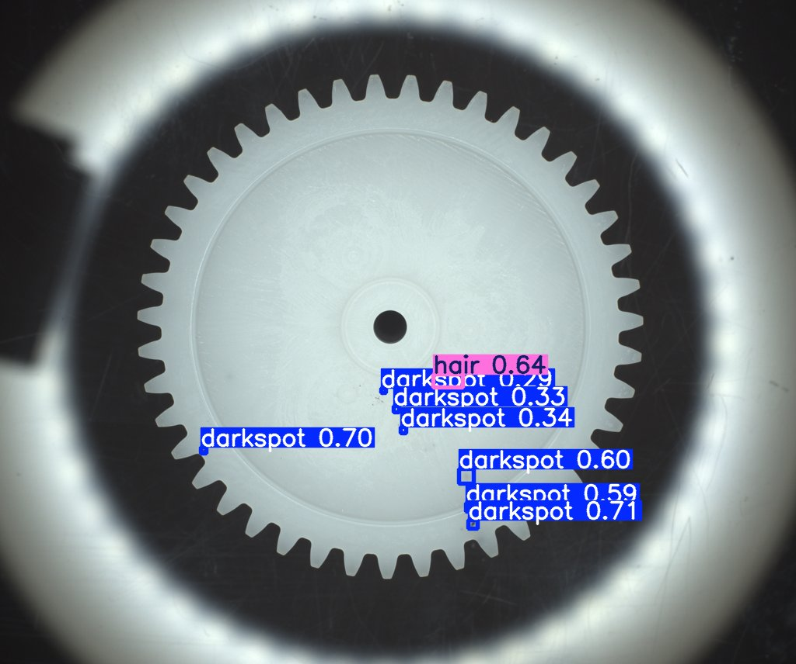
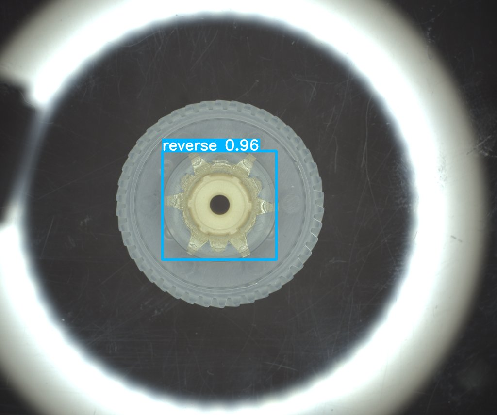
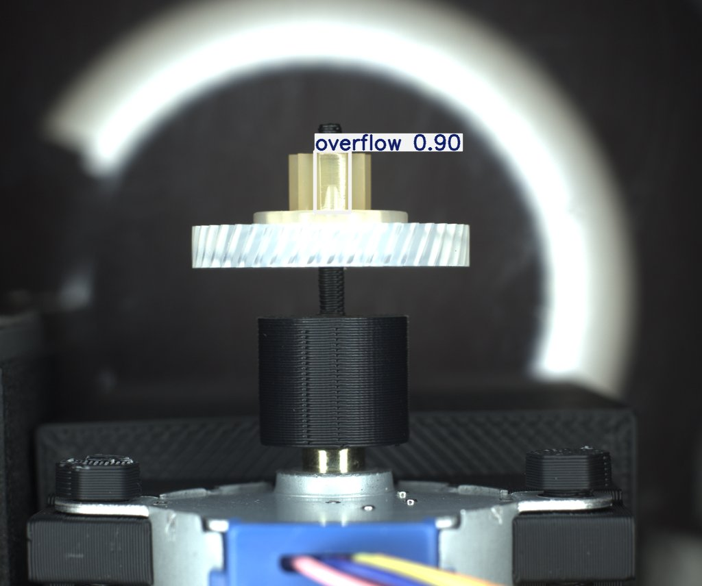

# GearVision: Automated Surface Defect Detection for Plastic Gears

A computer vision pipeline for industrial quality control. Trains a YOLOv8 object detection model on real inspection imagery, then runs fast, accurate defect localisation on new gear photos, fully automated from input folder to annotated output.

---

## Sample Results

| Multi-defect (endface) | Multiple darkspots | Reverse assembly | Tooth overflow |
|---|---|---|---|
|  |  |  |  |

The model detects and localises **16 surface defect types** including darkspot, perforation, hair, overflow and reverse, each with a confidence score.

---

## Overview

The model was trained on the [Plastic Gear Surface Defect Dataset](https://www.kaggle.com/datasets/yimingfang1994/plastic-gear-surface-defect-dataset) from Kaggle. The inference script loads `best.pt` and runs detection across a folder of images automatically, saving annotated results to disk.

---

## Project Structure

```
gear-defect-detection/
├── best.pt               # Trained model weights
├── run_detection.py      # Inference script
├── README.md
├── 5_endface378.png
├── 33_endface237.png
├── 42_endface911.png
├── 70_toothface111.png
└── test_images/          # Place input images here (.png / .jpg)
    └── .gitkeep
```

---

## Requirements

```
Python 3.8+
ultralytics
opencv-python
```

```bash
pip install ultralytics opencv-python
```

---

## Usage

1. Add gear images to `test_images/`.
2. Run:

```bash
python run_detection.py
```

Every image is processed automatically. Annotated images are saved to `results/` and a per-image summary is printed to the console:

```
Running on 10 images...

0_toothface165.png: overflow (91%)
2_endface501.png: darkspot (83%)
5_endface378.png: perforation (85%), darkspot (53%), hair (59%)
42_endface911.png: reverse (96%)
33_endface237.png: hair (64%), darkspot (70%), darkspot (60%), darkspot (71%)
...

Done. Results saved to /your/path/results
```

---

## Dataset

**Source:** [Plastic Gear Surface Defect Dataset on Kaggle](https://www.kaggle.com/datasets/yimingfang1994/plastic-gear-surface-defect-dataset)

Annotations are stored as per-image JSON files in LabelMe format. Polygon shapes were converted to axis-aligned bounding boxes in YOLO format (`class cx cy w h`, normalised 0 to 1).

---

## Training Configuration

| Parameter | Value |
|---|---|
| Base model | YOLOv8s |
| Epochs | 50 |
| Image size | 800 px |
| Batch size | 16 |
| Train / val split | 80% / 20% |
| Confidence threshold | 0.25 |

---

## Notes

- Confidence threshold can be adjusted via the `conf` argument in `model.predict()`.
